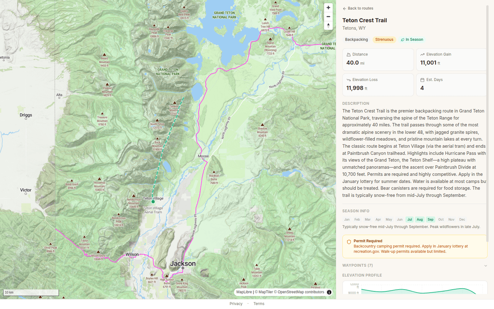

# Strange Grounds

Point at a route — the Teton Crest Trail, a ski line, a GPX file from the trip you bailed on last year — and get back one briefing: what the snowpack is doing, whether that stream crossing is going to be a problem, if there's a fire anywhere near your exit, and a green/yellow/red call on the whole thing.

**Live at [strange-ground.vercel.app](https://strange-ground.vercel.app)** — free, no account needed for your first briefing.



## Why this exists

Planning a backcountry trip means opening eight tabs: the avalanche forecast, the point forecast, a SNOTEL station that's hopefully near your route, a stream gauge, a fire map, and a satellite image if you're lucky. Then you cross-reference all of it in your head at 11pm.

Strange Grounds does the tab-opening for you. Draw a route on the map (or pick a popular one, or import a GPX/KML), hit **Generate**, and the system fetches conditions from every relevant source along your route in parallel, then has Claude write it up as a narrative briefing with a readiness assessment. Briefings get shareable links, and you can opt into email alerts if conditions shift before you go.

## Where the data comes from

| Source | What it knows |
|:---|:---|
| [NWS](https://www.weather.gov/) | Forecasts, alerts, hazards |
| [SNOTEL](https://www.nrcs.usda.gov/wps/portal/wcc/home/snowClimateMonitoring/snowpack/) | Snowpack depth and SWE at ~900 stations |
| [USGS](https://waterdata.usgs.gov/) | Real-time streamflow |
| [Sentinel-2](https://dataspace.copernicus.eu/) | Satellite imagery — true color, snow cover, snowline |
| [UAC / CAIC](https://utahavalanchecenter.org/) | Avalanche forecasts and danger ratings |
| [NIFC](https://www.nifc.gov/) | Active fire perimeters |
| [USNO](https://aa.usno.navy.mil/) | Sunrise, sunset, daylight |
| [OpenStreetMap](https://www.openstreetmap.org/) | Trail data for route context |

## How it's built

A Next.js 16 app with a MapLibre GL map talks over tRPC to Supabase (Postgres + PostGIS — routes, stations, and cached conditions live there, behind RLS). When you ask for a briefing, an [Inngest](https://www.inngest.com/) background job fans out to all the data sources in parallel, then hands the results to Claude for synthesis. Satellite imagery comes from the Copernicus Data Space Process API. Deployed on Vercel, watched by Sentry and Plausible, tested with Playwright.

The interesting parts of the codebase:

```
src/lib/data-sources/   # one adapter per environmental source
src/lib/synthesis/      # prompt construction + briefing generation
src/lib/inngest/        # the background job that ties it together
src/lib/routes/         # route segmentation, GPX parsing
src/components/map/     # MapLibre map, layers, drawing tools
supabase/migrations/    # PostGIS, RLS policies, RPCs
```

## Run it yourself

You'll need Node.js >= 18, a [Supabase](https://supabase.com/) project (free tier works), and API keys from [Anthropic](https://console.anthropic.com/), [Copernicus CDSE](https://dataspace.copernicus.eu/), and [MapTiler](https://www.maptiler.com/).

```bash
npm install
cp .env.local.example .env.local   # fill in Supabase, Anthropic, CDSE, MapTiler
npm run dev
```

With the dev server running, apply migrations and seed station data:

```bash
curl -X POST http://localhost:3000/api/setup
npm run seed   # ~900 SNOTEL stations, USGS gauges, avalanche zones — idempotent
```

Other scripts: `npm run build`, `npm run test` (Playwright), `npm run test:e2e` (full briefing flow), `npm run test:prod` (smoke test against production).
